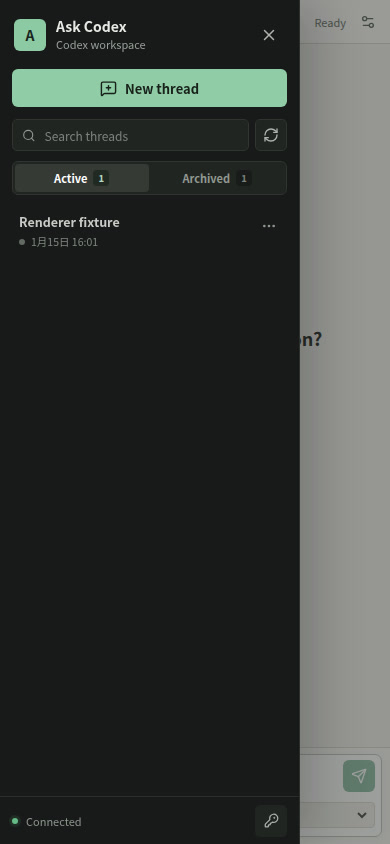

# Ask Codex

[简体中文](README.md) | English

Ask Codex is a local-first browser client for Codex. It talks to the official
`codex app-server` protocol instead of wrapping the terminal UI or patching the
Codex desktop application.

```text
Browser UI  <->  Ask Codex gateway  <->  codex app-server  <->  your workspace
              WebSocket             JSONL over stdio
```

The gateway keeps the Codex process and local credentials on the host. The
browser receives streamed thread, turn, tool, command, diff, and approval
events, but it does not get a general-purpose file-serving endpoint.

## Features

- Create, search, resume, and refresh Codex threads.
- Load long thread histories incrementally. Default history keeps bounded
  fallback behavior, while existing paginated history can recover oversized
  turns by item.
- Stream agent messages, reasoning summaries, plans, command output, file
  changes, MCP calls, and turn diffs.
- Render syntax-highlighted code blocks with copy and wrap controls, structured
  unified/split diffs, and grouped collapsible tool activity with bounded output.
- Review command and file-change approvals in the browser, and keep captured
  approval rationale attached to the matching command for the browser session.
- Answer structured questions from `request_user_input`.
- Choose the absolute working directory and sandbox when starting a thread,
  then select the next-turn model and reasoning effort beside the composer.
  Initial selections come from Codex's effective configuration; alternatives
  come from `model/list`.
- Select or paste PNG, JPEG, and WebP images, preview them, and send them with
  text or on their own. Temporary uploads, count, size, and lifecycle are
  bounded at the gateway, and image bytes do not enter WebSocket JSON.
- Interrupt an active turn.
- Responsive desktop and mobile layouts.
- Optional web access token, Origin checks, and loopback-only defaults.

## Screenshots

### Desktop


### Mobile



## Requirements

- Node.js 22.12 or newer.
- A recent Codex CLI with the documented app-server interface; the current
  implementation is verified with 0.145.0.
- An existing Codex login. Run `codex login` first if needed.

The app-server WebSocket transport is experimental. Ask Codex uses the more
established JSONL-over-stdio transport behind its own browser gateway.

## Development

```bash
git clone https://github.com/zlotus/ask-codex.git
cd ask-codex
npm install
ASK_CODEX_WORKSPACE=/absolute/path/to/project npm run dev
```

Open `http://127.0.0.1:5173`. Vite serves the UI and proxies API and WebSocket
traffic to the gateway on `127.0.0.1:4173`.

## Production

```bash
npm run build
ASK_CODEX_WORKSPACE=/absolute/path/to/project npm start
```

Open `http://127.0.0.1:4173`.

Configuration:

| Variable | Default | Purpose |
| --- | --- | --- |
| `ASK_CODEX_HOST` | `127.0.0.1` | HTTP and WebSocket bind address |
| `ASK_CODEX_PORT` | `4173` | Gateway port |
| `ASK_CODEX_WORKSPACE` | server working directory | Initial absolute Codex working directory |
| `ASK_CODEX_TOKEN` | unset | Browser access token; required for non-loopback binds |
| `ASK_CODEX_PUBLIC_ORIGIN` | unset | Exact external origin allowed through a trusted reverse proxy; requires `ASK_CODEX_TOKEN` |
| `CODEX_BIN` | `codex` | Codex CLI executable |

## Remote Access

Do not expose this service directly to the public internet. Anyone who can use
the UI can instruct Codex to read files, modify the selected workspace, run
commands, and present requests for broader access.

Treat `ASK_CODEX_TOKEN` like a password for the operating-system account that
runs Ask Codex. `ASK_CODEX_WORKSPACE` selects the initial directory; it is not
an access boundary. An authenticated browser can select another absolute
directory when starting a thread and can choose full-access sandbox mode,
subject to Codex approvals.

For access from another device:

1. Set a long random `ASK_CODEX_TOKEN`.
2. Bind to a private interface with `ASK_CODEX_HOST`.
3. Put the service behind TLS and an authenticated reverse proxy, VPN, or SSH
   tunnel.
4. Ensure proxy and application logs do not record authorization headers or
   WebSocket message bodies.
5. Keep Codex sandboxing enabled and review every escalation request, including
   the working directory and any session-level permission details.

The server refuses a non-loopback bind when no token is configured. This is a
single-user tool; the token is an access gate, not multi-user isolation or
role-based authorization.

### Cloudflare Tunnel

For the complete end-to-end setup, including Cloudflare Access, MFA enrollment,
App Launcher bootstrap, validation, and troubleshooting, see the
[Cloudflare Tunnel deployment guide](docs/cloudflare-tunnel.en.md).

A Cloudflare Tunnel can publish Ask Codex while the gateway remains bound to
loopback. You do not need to listen on `0.0.0.0` or open a port on your router:

```bash
# Load a strong random value into ASK_CODEX_TOKEN first.
ASK_CODEX_HOST=127.0.0.1 \
ASK_CODEX_PORT=4173 \
ASK_CODEX_PUBLIC_ORIGIN=https://codex.example.com \
ASK_CODEX_TOKEN="$ASK_CODEX_TOKEN" \
npm start
```

`ASK_CODEX_PUBLIC_ORIGIN` must be one complete `http://` or `https://` origin,
with no path, query string, fragment, or credentials.

Point the tunnel at that loopback service:

```yaml
ingress:
  - hostname: codex.example.com
    service: http://127.0.0.1:4173
  - service: http_status:404
```

Keep the original public `Host` header. In particular, do not configure
Cloudflare Tunnel's `httpHostHeader` as `localhost` or `127.0.0.1`; Ask Codex
checks both `Host` and `Origin` against `ASK_CODEX_PUBLIC_ORIGIN`. Configure
Cloudflare Access so only your identity can reach the hostname, require MFA,
and still use a strong random `ASK_CODEX_TOKEN` as a separate application-level
gate.

## Verification

```bash
npm run typecheck
npm test
npm run build
npm run lint
# With the production server already running on port 4173:
npm run check:visual
```

The Codex protocol is versioned with the installed CLI. When upgrading Codex,
run the verification commands and smoke-test thread resume plus command and
file approval flows.

## Why Not Reuse `pi-web` or `codex-web`?

`pi-web` embeds the pi agent SDK and its session model directly, so its backend
cannot be swapped for Codex without replacing the event and approval layers.
The current `0xcaff/codex-web` reuses a patched Codex Desktop Electron bundle
and private IPC. Ask Codex instead targets the documented app-server interface,
which keeps the integration smaller and avoids redistributing the desktop
application.

See the official [Codex app-server documentation](https://developers.openai.com/codex/app-server/)
for the underlying thread, turn, item, and approval protocol.
