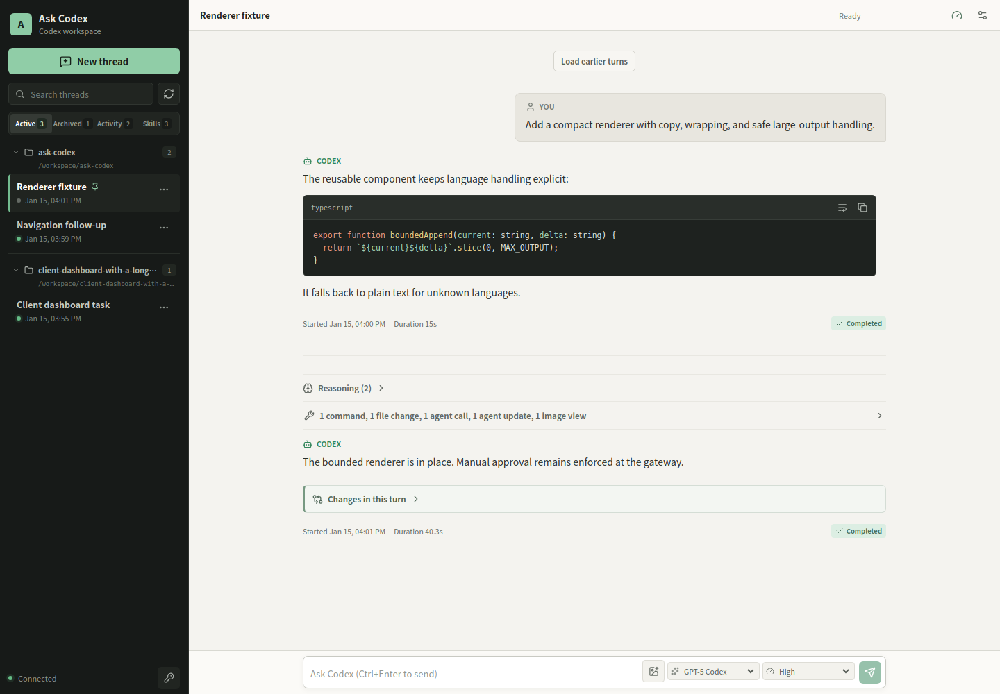
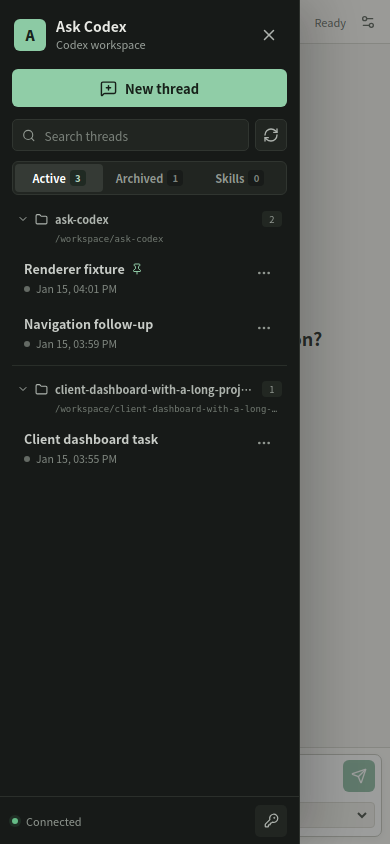

# Ask Codex

[简体中文](README.md) | English

Ask Codex is a local-first browser client for Codex. It talks to the official
`codex app-server` protocol instead of wrapping the terminal UI or patching the
Codex desktop application.

```text
Browser UI  <->  Ask Codex gateway  <->  codex app-server  <->  your workspace
              WebSocket             JSONL over stdio
```

The gateway keeps the Codex process and local credentials on the host. The
browser receives streamed thread, turn, tool, command, diff, and approval
events, but it does not provide a general-purpose file-serving endpoint that
accepts arbitrary paths.

## Features

- Create, search, resume, and refresh Codex threads. Active and Archived group
  threads by working directory, with pinned threads first inside each group. A
  third read-only Activity tab collects cross-thread approval, input, running,
  and recent states. Viewing the directory does not resume or claim threads in
  the background; selecting an entry opens that thread explicitly.
- Use desktop right-click, mobile long press, or the `...` menu to rename, pin,
  or unpin a thread, archive an idle thread from Active, restore a thread from
  Archived, or permanently delete an idle thread from either view after
  confirmation. Rename and pin actions remain available during an active turn;
  archive and delete do not.
- Browse a fourth, read-only Skills tab that groups official `skills/list`
  metadata by working directory and shows each skill's name, description,
  scope, and enabled state. The directory first loads when the tab is opened;
  manual refresh asks Codex to bypass its cache, and `skills/changed` refreshes
  a directory that has already been opened. The gateway strictly rebuilds
  request parameters, flattens only `interface.shortDescription`, and strips
  skill paths, dependencies, the remaining interface metadata, and specific
  error text from the response.
- Load long thread histories incrementally. Default history keeps bounded
  fallback behavior, while existing paginated history can recover oversized
  turns by item.
- Stream agent messages, reasoning summaries, plans, command output, file
  changes, MCP calls, and turn diffs. Consecutive historical reasoning with
  content stays grouped and expandable in place, while each turn in progress
  keeps a fixed reasoning status slot at its bottom: active reasoning animates
  and idle reasoning appears muted. Structured plans in progress gain a compact
  expandable status above the composer, and turn diffs are explicitly presented
  as whole-turn change summaries.
- Render syntax-highlighted code blocks with copy and wrap controls, structured
  unified/split diffs, and grouped collapsible tool activity with bounded output.
  Consecutive first-class machine activities form a zero-gap stack separated only
  by single rules, including commands, file changes, MCP calls, searches,
  dynamic tools, subagent/collaboration activity, image views, and image
  generation.
- Review command and file-change approvals in the browser, and keep captured
  approval rationale attached to the matching command for the browser session.
- Every ordinary direct turn defaults to strict `untrusted` approval. An
  existing idle thread or configured new-thread draft can temporarily arm the
  next direct turn for `on-request` sandbox-aware auto-run. Actions already
  allowed by the active sandbox run automatically, while sandbox escalation,
  restricted network access, and writes outside the workspace still surface
  for human approval. The control is disabled while Working, restores the
  strict default after completion or a failed start, and must be armed again
  for each later turn. Thread creation, resume, fork, and cross-device queued
  sends remain fixed to `on-request`, while steering carries no policy. The
  browser cannot submit `never`, `granular`, or reviewer values, and the design
  uses no experimental settings API.
- Answer structured questions from `request_user_input`.
- Choose the absolute working directory and sandbox when starting a thread,
  then select the next-turn model and reasoning effort beside the composer.
  The working directory defaults to the currently selected thread's `cwd`, or
  to `ASK_CODEX_WORKSPACE` when no thread is selected. A new thread's initial
  sandbox is always `workspace-write`. Initial model and reasoning selections
  come from Codex's effective configuration; alternatives come from `model/list`.
- Open a read-only Usage panel from the toolbar for current-thread tokens,
  latest-context use, account activity, and rate-limit windows. Account data
  comes from narrowly allowed and projected `account/usage/read` and
  `account/rateLimits/read` calls. Sign-in modes that do not support them show
  an unavailable state instead of presenting the data as billing or USD cost.
  Rolling updates cannot be overwritten by an older read, and reached rate or
  spend limits are called out explicitly.
- The toolbar distinguishes connection, automatic retry attempts, and
  resynchronization, and provides an immediate retry action. A bounded read-only
  probe restarts Codex after a child-process error, while a WebSocket failure
  rebuilds the browser connection. The selected thread is then restored from a
  read-only snapshot before sending is re-enabled. A failed sync remains
  blocking and exposes a read-only retry. Unconfirmed writes are not replayed,
  and background `thread/resume` is not used in a way that could change
  approval routing.
- Keep editing text drafts while a turn runs or the connection resynchronizes.
  Enter inserts a newline; send with the button or `Ctrl+Enter`, with
  `Cmd+Enter` also supported on macOS. Unconfirmed sends remain separate from
  new typing so an asynchronous failure cannot overwrite the active draft.
- Queue plain text for an existing thread in the server-persistent message
  outbox, then explicitly send or cancel it from another authenticated device.
  Reconnect, startup, and busy threads never execute queued text automatically,
  and queue items never become steering. The gateway checks thread state and
  the last turn before sending; an uncertain write can only be removed after
  native history is checked and is never replayed automatically.
- Select or paste PNG, JPEG, and WebP images, preview them, and send them with
  text or on their own. After a successful send, the browser retains bounded,
  clickable thumbnails locally. The same browser profile and Origin can restore
  available previews after a page or thread reload and a browser restart; local
  copies have a default 30-day TTL and an eight-image/40-MiB limit. Clearing site
  data, browser storage reclamation, or using another device, browser, profile,
  or Origin causes historical images to fall back to a safe placeholder that
  exposes no path. Temporary server uploads retain their gateway-enforced count,
  size, and lifecycle limits, and image bytes do not enter WebSocket JSON.
- Explicit absolute local file links in completed Agent messages can be
  downloaded after an inline confirmation when they refer to regular files
  within the authoritative app-server `thread.cwd`. The gateway issues only
  short-lived, single-use opaque capabilities and does not accept paths from
  the browser. There is no `ASK_CODEX_DOWNLOAD_ROOTS` and no global download
  root. This capability cannot list directories, read arbitrary paths, or
  preview files; it is not a general-purpose file service.
- Interrupt an active turn.
- Responsive desktop and mobile layouts.
- Optional web access token, Origin checks, and loopback-only defaults.

## Screenshots

### Desktop



### Mobile



## Requirements

- Node.js 22.12 or newer.
- A recent Codex CLI with the documented app-server interface; the current
  implementation is verified with 0.147.0.
- An existing Codex login. Run `codex login` first if needed.

The app-server WebSocket transport is experimental. Ask Codex uses the more
established JSONL-over-stdio transport behind its own browser gateway.

## Development

```bash
git clone https://github.com/zlotus/ask-codex.git
cd ask-codex
npm install
ASK_CODEX_WORKSPACE=/absolute/path/to/project npm run dev
```

Open `http://127.0.0.1:5173`. Vite serves the UI and proxies API and WebSocket
traffic to the gateway on `127.0.0.1:4173`.

## Production

```bash
npm run build
ASK_CODEX_WORKSPACE=/absolute/path/to/project npm start
```

Open `http://127.0.0.1:4173`.

Configuration:

| Variable | Default | Purpose |
| --- | --- | --- |
| `ASK_CODEX_HOST` | `127.0.0.1` | HTTP and WebSocket bind address |
| `ASK_CODEX_PORT` | `4173` | Gateway port |
| `ASK_CODEX_WORKSPACE` | server working directory | Initial absolute Codex working directory |
| `ASK_CODEX_TOKEN` | unset | Browser access token; required for non-loopback binds |
| `ASK_CODEX_PUBLIC_ORIGIN` | unset | Exact external origin allowed through a trusted reverse proxy; requires `ASK_CODEX_TOKEN` |
| `ASK_CODEX_QUEUE_PATH` | `$XDG_STATE_HOME/ask-codex/message-queue.json`, or `~/.local/state/ask-codex/message-queue.json` without XDG state | Absolute JSON path for the cross-device text queue; exactly one gateway process may use it |
| `CODEX_BIN` | `codex` | Codex CLI executable |

The queue stores plaintext with the permissions of the operating-system account
running Ask Codex; its directory and file are created as `0700` and `0600`.
It stores no token, attachment, path, or approval content. Two gateway processes
must not share one queue file.

## Remote Access

Do not expose this service directly to the public internet. Anyone who can use
the UI can instruct Codex to read files, modify the selected workspace, run
commands, and present requests for broader access. They can also permanently
delete threads and possible descendant sessions without a Codex approval.

Treat `ASK_CODEX_TOKEN` like a password for the operating-system account that
runs Ask Codex. `ASK_CODEX_WORKSPACE` selects the initial directory; it is not
an access boundary. An authenticated browser can select another absolute
directory when starting a thread and can choose full-access sandbox mode,
subject to Codex approvals.
Setting `thread.cwd=/` creates a very broad candidate scope for restricted file
downloads. After Origin, Host, and token authentication, an individual download
depends only on a short-lived, single-use opaque capability issued by the server.
Protect a capability as a temporary credential; do not treat it as persistent
authority.

For access from another device:

1. Set a long random `ASK_CODEX_TOKEN`.
2. Bind to a private interface with `ASK_CODEX_HOST`.
3. Put the service behind TLS and an authenticated reverse proxy, VPN, or SSH
   tunnel.
4. Ensure proxy and application logs do not record authorization headers or
   WebSocket message bodies.
5. Keep Codex sandboxing enabled and review every escalation request, including
   the working directory and any session-level permission details.

The server refuses a non-loopback bind when no token is configured. This is a
single-user tool; the token is an access gate, not multi-user isolation or
role-based authorization.

### Cloudflare Tunnel

For the complete end-to-end setup, including Cloudflare Access, MFA enrollment,
App Launcher bootstrap, validation, and troubleshooting, see the
[Cloudflare Tunnel deployment guide](docs/cloudflare-tunnel.en.md).

A Cloudflare Tunnel can publish Ask Codex while the gateway remains bound to
loopback. You do not need to listen on `0.0.0.0` or open a port on your router:

```bash
# Load a strong random value into ASK_CODEX_TOKEN first.
ASK_CODEX_HOST=127.0.0.1 \
ASK_CODEX_PORT=4173 \
ASK_CODEX_PUBLIC_ORIGIN=https://codex.example.com \
ASK_CODEX_TOKEN="$ASK_CODEX_TOKEN" \
npm start
```

`ASK_CODEX_PUBLIC_ORIGIN` must be one complete `http://` or `https://` origin,
with no path, query string, fragment, or credentials.

Point the tunnel at that loopback service:

```yaml
ingress:
  - hostname: codex.example.com
    service: http://127.0.0.1:4173
  - service: http_status:404
```

Keep the original public `Host` header. In particular, do not configure
Cloudflare Tunnel's `httpHostHeader` as `localhost` or `127.0.0.1`; Ask Codex
checks both `Host` and `Origin` against `ASK_CODEX_PUBLIC_ORIGIN`. Configure
Cloudflare Access so only your identity can reach the hostname, require MFA,
and still use a strong random `ASK_CODEX_TOKEN` as a separate application-level
gate.

## Verification

```bash
npm run typecheck
npm test
npm run build
npm run lint
# With the production server already running on port 4173:
npm run check:visual
```

The Codex protocol is versioned with the installed CLI. When upgrading Codex,
run the verification commands and smoke-test thread resume plus command and
file approval flows.

## Why Not Reuse `pi-web` or `codex-web`?

`pi-web` embeds the pi agent SDK and its session model directly, so its backend
cannot be swapped for Codex without replacing the event and approval layers.
The current `0xcaff/codex-web` reuses a patched Codex Desktop Electron bundle
and private IPC. Ask Codex instead targets the documented app-server interface,
which keeps the integration smaller and avoids redistributing the desktop
application.

See the official [Codex app-server documentation](https://developers.openai.com/codex/app-server/)
for the underlying thread, turn, item, and approval protocol.
